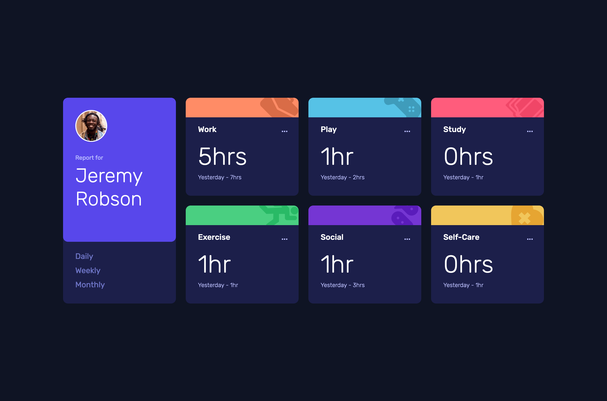
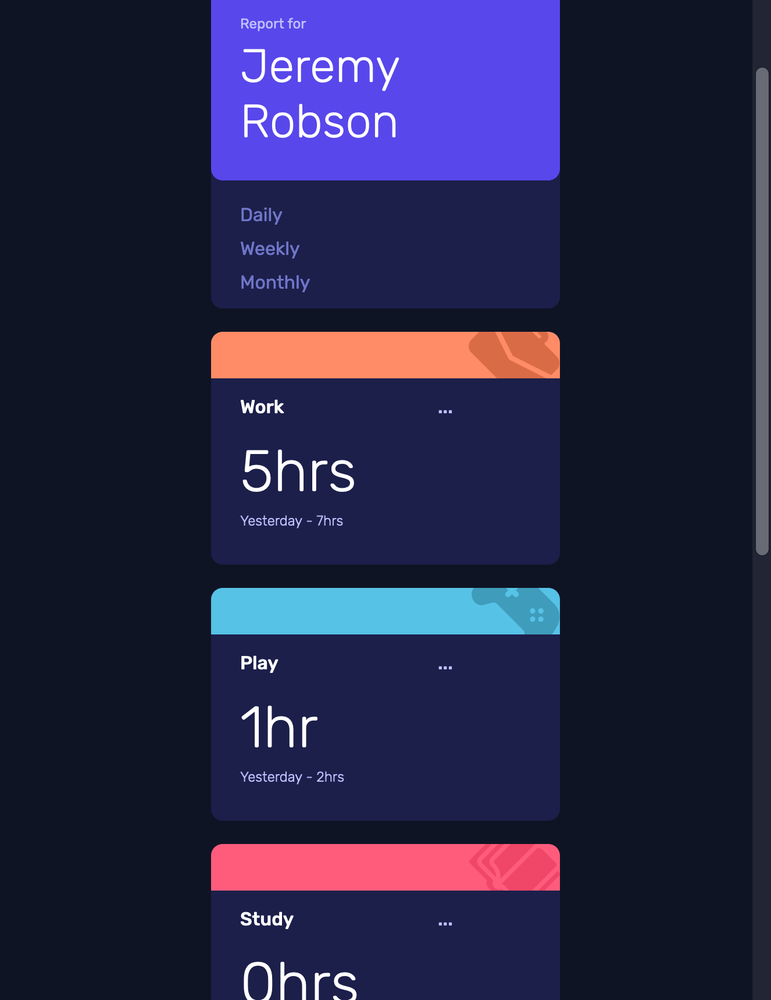

# Frontend Mentor - Time tracking dashboard solution

This is a solution to the [Time tracking dashboard challenge on Frontend Mentor](https://www.frontendmentor.io/challenges/time-tracking-dashboard-UIQ7167Jw).

## Table of contents

- [Overview](#overview)
  - [The challenge](#the-challenge)
  - [Screenshot](#screenshot)
  - [Links](#links)
- [My process](#my-process)
  - [Built with](#built-with)
  - [What I learned](#what-i-learned)
  - [Continued development](#continued-development)
- [Author](#author)
- [Acknowledgments](#acknowledgments)

**Note: Delete this note and update the table of contents based on what sections you keep.**

## Overview

### The challenge

Users should be able to:

- View the optimal layout for the site depending on their device's screen size
- See hover states for all interactive elements on the page
- Switch between viewing Daily, Weekly, and Monthly stats

### Screenshot
Desktop

Mobile

### Links

- Solution URL: [Add solution URL here](https://github.com/KurtReti/time-tracking-dashboard-main)
- Live Site URL: [Add live site URL here](https://kurtreti.github.io/time-tracking-dashboard-main/)

## My process

I didn't implement a mobile first workflow for this challenge because I initially started it just playing around with CSS Grid.

After I got the layout with CSS grid I finished off the initial HTML and began styling the cards.

After the styling was complete I fixed the layout within the cards with divs and moved onto the javascript to add the updating values.

When the javascript was finalised I added the active states on CSS that I missed initially and made a few final touches.

### Built with

- Semantic HTML5 markup
- CSS custom properties
- CSS Grid

### What I learned

Learned about CSS Grid layout and JSON files, as well as some further javascript.

### Continued development

Use this section to outline areas that you want to continue focusing on in future projects. These could be concepts you're still not completely comfortable with or techniques you found useful that you want to refine and perfect.

## Author

- LinkedIn - [Kurt Reti](https://www.linkedin.com/in/kurt-reti-aa469924a/)
- Frontend Mentor - [@kurtreti](https://www.frontendmentor.io/profile/kurtreti)
- GitHub - [KurtReti](https://github.com/KurtReti)

## Acknowledgments

Used a technique I learnt from front end mentor user @correlucas to save colours in the CSS to be reused in the project without having to remember the hexcodes.
